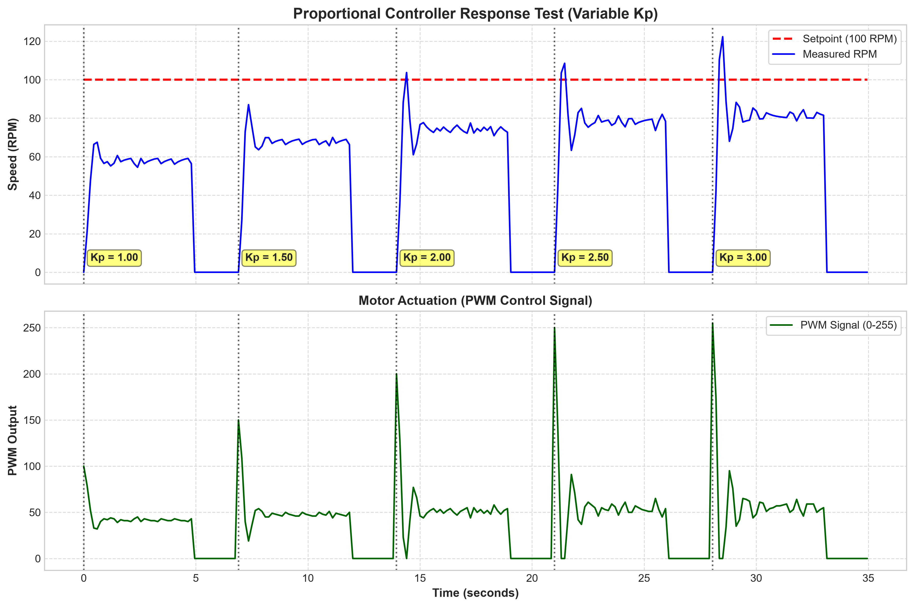
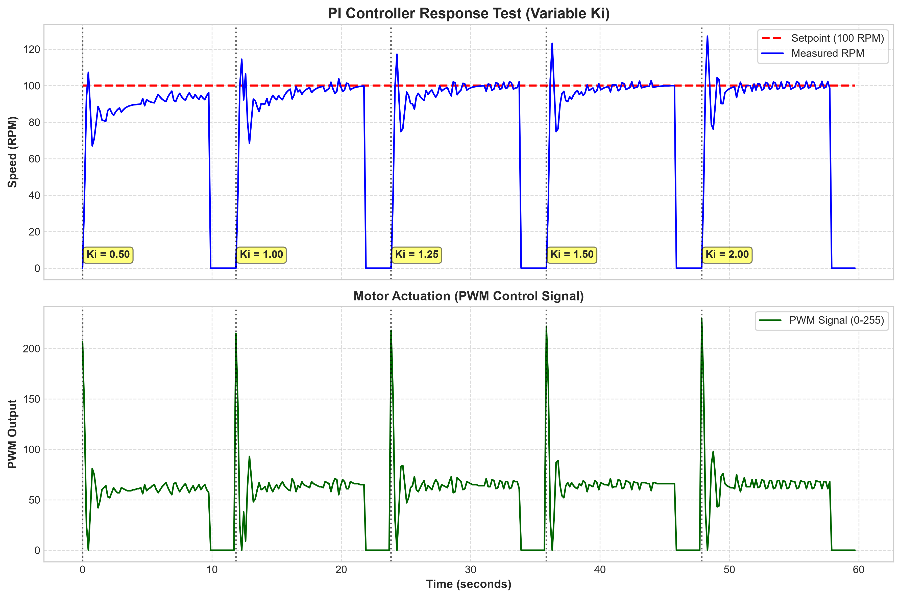
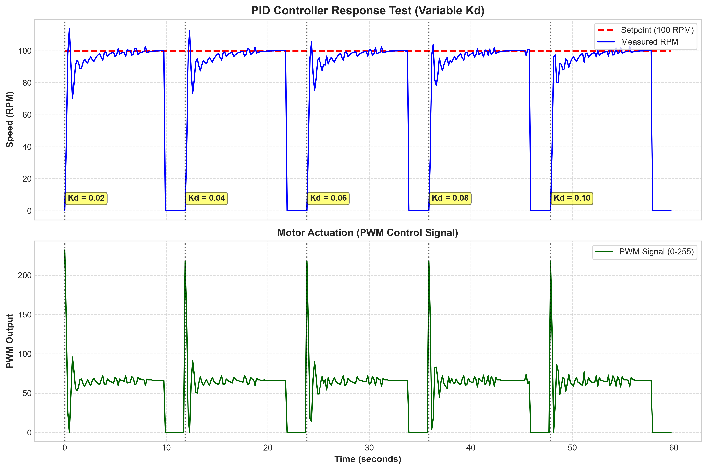
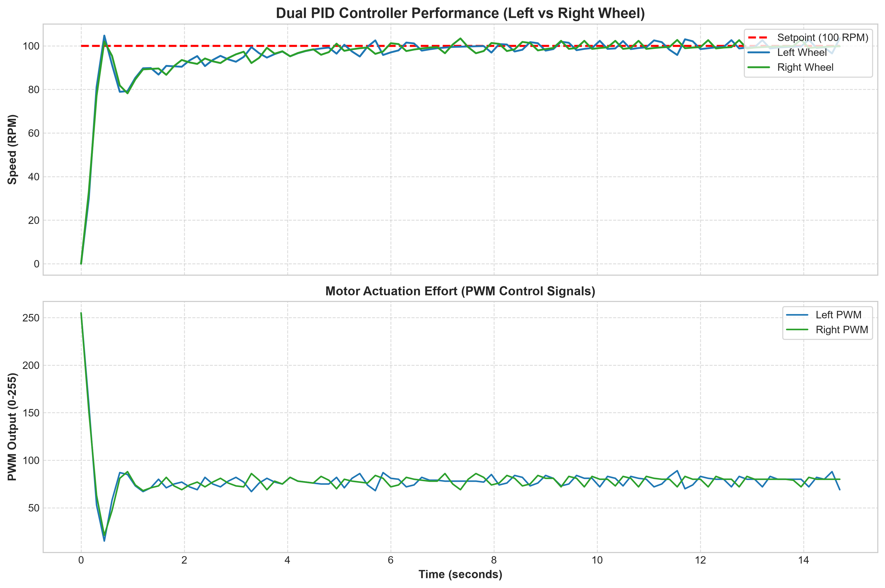

# Project 07: Dual PID Speed Control for Differential Wheeled Robot

This repository contains the development, parametric tuning, and experimental validation of a closed-loop **PID (Proportional-Integral-Derivative)** control system for independent wheel speed control on a mobile robot.

---

## Project Overview

The primary objective is to ensure that both wheels accurately maintain a target speed of **100 RPM**, minimizing overshoot and eliminating steady-state error to guarantee straight and stable robot motion.

---

## Digital Signal Filtering (EMA Filter)

### What is the EMA Filter?
The **Exponential Moving Average** (EMA) filter is a first-order digital low-pass filter. Unlike a simple moving average (which requires storing historical data points in the Arduino memory), the EMA filter applies exponential weighting to past measurements, giving higher weight to the most recent reading while smoothing out abrupt variations.

The discrete difference equation implemented on the Arduino is given by:

$$y[n] = \alpha \cdot x[n] + (1 - \alpha) \cdot y[n-1]$$

Where:
* $y[n]$ is the filtered RPM value at the current time step.
* $x[n]$ is the raw rotational speed calculated from encoder pulse counts.
* $y[n-1]$ is the filtered value from the previous sample cycle.
* $\alpha = 0.3$ is the smoothing factor.

### Why was this filter necessary?
1. **Low Encoder Resolution:** Since the optical encoders yield only 40 transitions per revolution, slight timing variations in pulse counting over a short sampling interval (**150 ms**) generate quantization noise (artificial RPM spikes).
2. **Protection of Derivative Action ($K_d$):** The derivative term of the PID computes the rate of change of the error. If the input signal contains high-frequency noise, the derivative amplifies this noise drastically, causing the PWM signal to chatter and inducing severe mechanical jitter in the motors.
3. **Trade-off Between Filtering and Lag:** By selecting $\alpha = 0.3$, **30%** weight is given to the new measurement and **70%** to the filtered history. This effectively attenuates high-frequency noise without introducing significant phase lag that could destabilize the PID closed-loop response.

---

## 1. Parametric PID Tuning

The system tuning was performed sequentially by evaluating the individual impact of each gain on the dynamic motor response.

### 1.1. Proportional Action ($K_p$)

* **Fixed Test Parameters:** $K_i = 0.00$, $K_d = 0.00$

#### Graph Analysis & Value Selection:
* **Observed Behavior:** Values of $K_p$ ranging from $1.00$ to $3.00$ were tested. With $K_p = 1.00$, the system response is sluggish and settles at a value significantly below the 100 RPM Setpoint (~60 RPM), demonstrating a high steady-state error. As $K_p$ is increased to $2.50$ and $3.00$, the rise time becomes faster; however, pronounced overshoots (>120 RPM) appear and the PWM control signal suffers violent startup saturation spikes.
* **Selected Value ($K_p = 2.00$):** $K_p = 2.00$ was selected as it provides the optimal balance between response speed and system stability. It guarantees a fast rise time without inducing excessive oscillations, placing the system response in the ideal operating zone for the integral action to take over.

---

### 1.2. Integral Action ($K_i$)

* **Fixed Test Parameters:** $K_p = 2.00$, $K_d = 0.00$

#### Graph Analysis & Value Selection:
* **Observed Behavior:** Keeping $K_p = 2.00$ and $K_d = 0.00$, values of $K_i$ between $0.50$ and $2.00$ were evaluated. With $K_i = 0.50$, the integral action accumulates error slowly, taking several seconds to drive the motor to the Setpoint. Conversely, higher values such as $K_i = 1.50$ and $K_i = 2.00$ lead to excessive error accumulation, causing high speed peaks (>125 RPM) and transient instability (severe windup).
* **Selected Value ($K_i = 1.25$):** The gain $K_i = 1.25$ proved to be ideal. It completely eliminates steady-state error within a short time window and brings the speed consistently to **100 RPM**. The anti-windup clamping mechanism prevented prolonged integrator saturation during step changes.

---

### 1.3. Derivative Action ($K_d$)

* **Fixed Test Parameters:** $K_p = 2.00$, $K_i = 1.25$

#### Graph Analysis & Value Selection:
* **Observed Behavior:** With the baseline PI controller established ($K_p = 2.00, K_i = 1.25$), $K_d$ values were tested to damp the response. Derivative action acts proportionally to the rate of error change, serving as a "digital brake" when speed approaches 100 RPM rapidly. Without the derivative term, overshoot from the integral action is visible; however, setting $K_d$ too high amplifies residual encoder noise, causing chatter in the PWM control signal.
* **Selected Value ($K_d = 0.06$):** A value of $K_d = 0.06$ provided sufficient damping to suppress the initial overshoot, smoothly stabilizing the speed around 100 RPM without introducing destructive chatter in H-bridge driver actuation.

---

## 2. PID Control and Experimental Results

Following parametric testing, the final selected gains applied simultaneously to both motor controllers were:

$$\mathbf{K_p = 2.00}, \quad \mathbf{K_i = 1.25}, \quad \mathbf{K_d = 0.06}$$

### System Performance (15-Second Test Run)

### Key Highlights:
* **Average Speed:** **99.75 RPM** on both wheels (a relative error of only **0.25%** from the **100 RPM** Setpoint).
* **Synchronization:** Speed tracking curves for both wheels overlap almost perfectly, ensuring straight-line tracking without heading drift.
* **Settling Time:** Reaches steady state in approximately **3 s** with less than **4%** overshoot.
* **Actuation Signal (PWM):** Smooth stabilization around **PWM ≈ 78**, without saturation or destructive oscillations in the actuators.