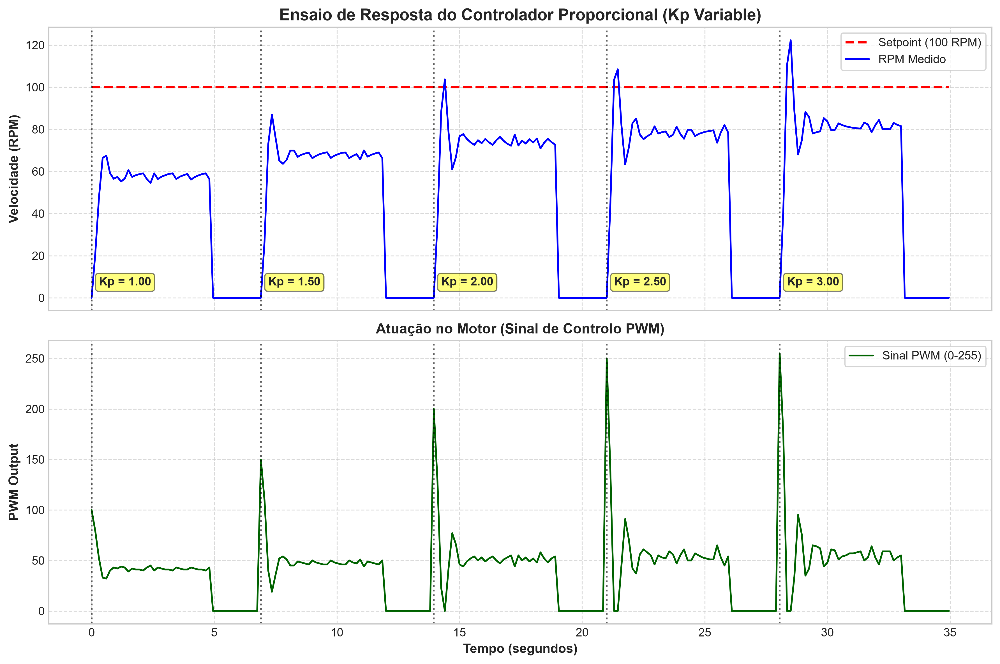
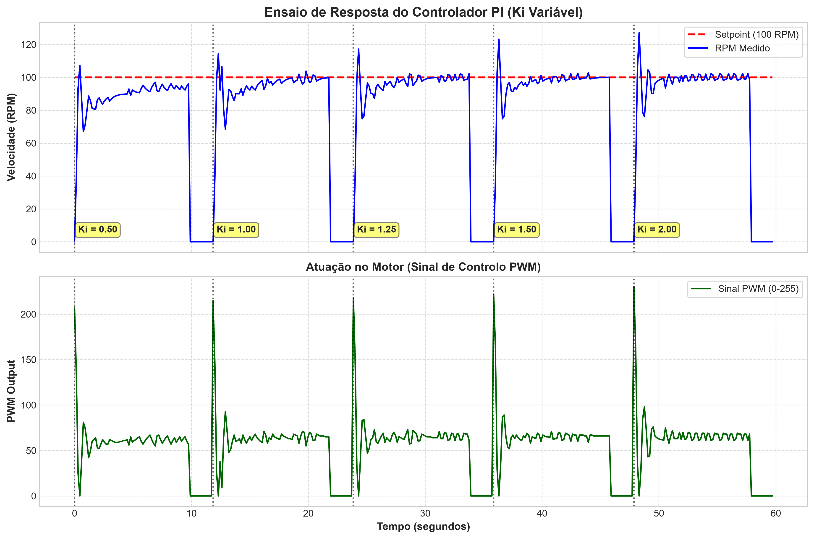
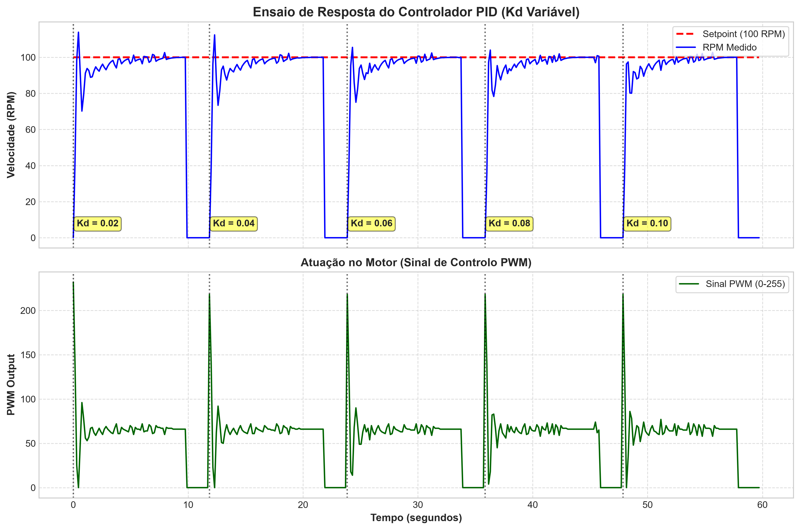
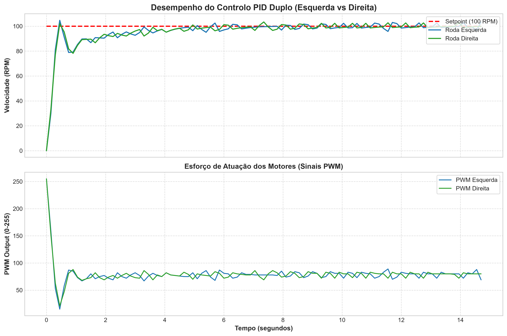

# 🤖 Projeto 07: Controlo PID Duplo de Velocidade para Robô Diferencial

Este repositório contém o desenvolvimento, afinação paramétrica e validação experimental de um sistema de controlo **PID (Proporcional-Integral-Derivativo)** em malha fechada para controlo independente da velocidade das rodas de um robô móvel.

---

## 📌 Visão Geral do Projeto

O objetivo principal consiste em garantir que ambas as rodas mantenham a velocidade especificada de **100 RPM** com precisão, minimizando o sobressinal (*overshoot*) e eliminando o erro em regime permanente, assegurando que o robô se desloque de forma estável.


---

## 🎛️ Filtragem Digital de Sinal (Filtro EMA)

### O que é o Filtro EMA?
O filtro de **Média Móvel Exponencial** (*Exponential Moving Average* — EMA) é um filtro passa-baixo digital de primeira ordem. Ao contrário de uma média móvel simples (que exige armazenar um histórico de dados na memória do Arduino), o filtro EMA aplica uma ponderação exponencial aos dados passados, dando mais peso à medição recente enquanto atenua variações bruscas.

A equação de diferença discreta implementada no Arduino é dada por:

$$y[n] = \alpha \cdot x[n] + (1 - \alpha) \cdot y[n-1]$$

Onde:
* $y[n]$ é o valor de RPM filtrado no instante atual.
* $x[n]$ é a velocidade bruta calculada através da contagem de pulsos do encoder.
* $y[n-1]$ é o valor filtrado no ciclo anterior.
* $\alpha = 0.3$ é o fator de suavização (*smoothing factor*).

### Por que foi necessário utilizar este filtro?
1. **Baixa Resolução dos Encoders:** Como os encoders óticos possuem apenas 40 transições por rotação, pequenas variações no tempo de contagem dos pulsos num intervalo curto de amostragem (**150 ms**) geram "ruído de quantização" (picos artificiais de RPM).
2. **Proteção da Ação Derivativa ($K_d$):** A componente derivativa do PID calcula a taxa de variação do erro. Se o sinal de entrada tiver ruído, a derivada amplifica esse ruído drasticamente, fazendo com que o sinal PWM oscile bruscamente e provoque trepidação destrutiva nos motores.
3. **Equilíbrio entre Filtragem e Atraso (*Lag*):** Ao escolher $\alpha = 0.3$, atribui-se **30%** de peso à nova leitura e **70%** ao histórico filtrado. Isso atenua com eficácia o ruído de alta frequência sem introduzir um atraso de fase relevante que pudesse desestabilizar a resposta do PID.

---

## 🔬 1. Estudo Paramétrico do PID

A afinação do sistema foi realizada de forma sequencial, analisando o impacto individual de cada ganho no comportamento dinâmico do motor.

### 1.1. Ação Proporcional ($K_p$)

* **Parâmetros Fixos do Ensaio:** $K_i = 0.00$, $K_d = 0.00$



#### 🔍 Análise do Gráfico e Justificação do Valor:
* **Comportamento Observado:** Foram testados valores de $K_p$ entre $1.00$ e $3.00$. Com $K_p = 1.00$, o sistema apresenta uma subida muito lenta e estabiliza num valor significativamente inferior ao *Setpoint* de 100 RPM (~60 RPM), demonstrando um erro elevado em regime permanente. À medida que $K_p$ é incrementado para $2.50$ e $3.00$, a resposta torna-se mais rápida, contudo surgem *overshoots* acentuados (>120 RPM) e o sinal de controlo PWM sofre picos violentos de saturação no arranque.
* **Escolha do Valor ($K_p = 2.00$):** Selecionou-se $K_p = 2.00$ por oferecer a melhor relação entre velocidade de resposta e estabilidade. Garante um tempo de subida reduzido sem induzir oscilações excessivas no motor, aproximando o sistema da zona de funcionamento pretendida para que a ação integral possa atuar a seguir.

---

### 1.2. Ação Integral ($K_i$)

* **Parâmetros Fixos do Ensaio:** $K_p = 2.00$, $K_d = 0.00$



#### 🔍 Análise do Gráfico e Justificação do Valor:
* **Comportamento Observado:** Mantendo $K_p = 2.00$ e $K_d = 0.00$, avaliaram-se valores de $K_i$ entre $0.50$ e $2.00$. Com $K_i = 0.50$, a ação integral acumula o erro de forma muito lenta, demorando vários segundos a conduzir o motor até ao *Setpoint*. Por outro lado, para valores elevados como $K_i = 1.50$ e $K_i = 2.00$, a acumulação excessiva de erro gera picos de velocidade elevados (>125 RPM) e instabilidade transitória (*windup* elevado).
* **Escolha do Valor ($K_i = 1.25$):** O ganho $K_i = 1.25$ provou ser o valor ideal. Elimina totalmente o erro em regime permanente num curto espaço de tempo e eleva a velocidade para os **100 RPM** de forma consistente. O mecanismo de *Anti-Windup* implementado evitou a saturação prolongada do integrador durante este degrau.

---

### 1.3. Ação Derivativa ($K_d$)

* **Parâmetros Fixos do Ensaio:** $K_p = 2.00$, $K_i = 1.25$



#### 🔍 Análise do Gráfico e Justificação do Valor:
* **Comportamento Observado:** Com a base do controlador $PI$ definida ($K_p = 2.00, K_i = 1.25$), testaram-se valores de $K_d$ para amortecer a resposta. A ação derivativa atua proporcionalmente à taxa de variação do erro, funcionando como um "travo digital" quando a velocidade se aproxima rapidamente dos 100 RPM. Sem o termo derivativo, nota-se o *overshoot* do termo integral; porém, com valores de $K_d$ demasiado altos, qualquer pequeno ruído residual do encoder seria amplificado, provocando trepidação no sinal PWM.
* **Escolha do Valor ($K_d = 0.06$):** O valor $K_d = 0.06$ foi suficiente para amortecer o *overshoot* inicial, estabilizando suavemente a velocidade na transição para os 100 RPM sem provocar ruído destrutivo na atuação do atuador Ponte H.

---

## 🚀 2. Controlo PID e Resultados

Após os ensaios paramétricos, os ganhos finais selecionados e aplicados em simultâneo a ambos os motores foram:

$$\mathbf{K_p = 2.00}, \quad \mathbf{K_i = 1.25}, \quad \mathbf{K_d = 0.06}$$

### 📊 Desempenho do Sistema (Ensaio de 15 Segundos)



### 📈 Destaques da Análise:
* **Velocidade Média:** **99.75 RPM** em ambas as rodas (erro relativo de apenas **0.25%** em relação ao *Setpoint* de **100 RPM**).
* **Sincronismo:** Curvas de velocidade das duas rodas praticamente coladas, garantindo deslocamento em linha reta sem desvios.
* **Tempo de Resposta:** Alcança o regime permanente em cerca de **3 s** com sobressinal inferior a **4%**.
* **Sinal de Atuação (PWM):** Estabilização suave em torno de **PWM ≈ 78**, sem saturação ou oscilações destrutivas nos atuadores.

---

## 🛠️ Como Executar

1. **Carregar o Código no Arduino:**
   Abre o ficheiro `arduino/controlo_pid_duplo.ino` na IDE do Arduino e faz o *upload* para a placa.
2. **Executar o Data Logger:**
   Fecha o Monitor Série da IDE do Arduino e corre o script de recolha no terminal:
   ```bash
   python python/logger_pid.py
   ```
3. **Gerar os Gráficos de Análise:**
   Após a conclusão automática do ensaio de 15 segundos, executa:
   ```bash
   python python/analise_pid.py
   ```

---

## 📜 Licença
Projeto desenvolvido no âmbito do módulo de Controlo e Robótica (CRIA 7). Livre para reutilização e fins educativos.